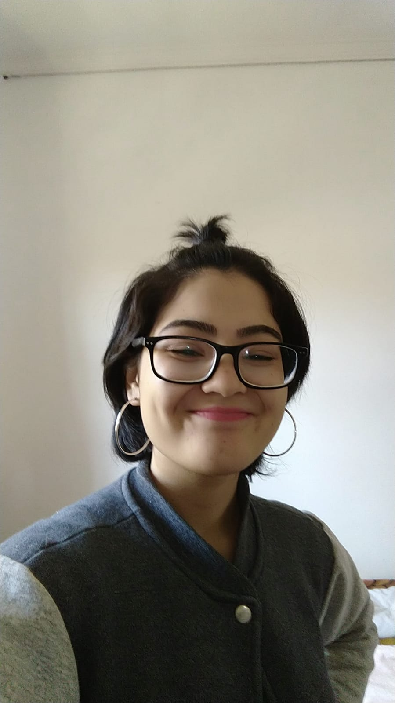

# Vecep - Fuvest

> 2021 web project for our 'TCC': Vecep - Fuvest

## :book: About the project
Our purpose is to help our users lead towards USP's (The University of São Paulo) acceptance, in the best, old-fashioned way: by practicing, practicing and practicing!

As an undergraduate thesis project, Vecep - Fuvest faces some difficulties on whether to prioritize/decide to implement a feature or not. For the moment, we've decided to only carry through essential items.

### Current progress and next steps

The project is still under the development stage and its future updates will be focused on:

- [x] Design concept
- [x] Project setup
- [x] Frontend main pages
- [x] Database structure
- [ ] Backend core
- [ ] Client/Server integration
- [ ] Populate database
- [ ] Carry out front
- [ ] User/login feature

## 💻 Technologies
This project runs on:

* [ReactJS](https://reactjs.org/)
* [NodeJS](https://nodejs.org/en/about/)
* [ExpressJS](https://expressjs.com/pt-br/)
* [MySQL](https://www.mysql.com/why-mysql/)
* [Knex](https://knexjs.org/)

## 📫 Contributing **(currently restricted)**
In order to contribute to Vecep - Fuvest, make sure you'll stick to the following steps:

1. Create a new branch: `git checkout -b <branch_name>`.
2. Work on and commit your changes: `git commit -m '<mensagem_commit>'`
3. Publish your branch and push your changes: `git push origin <branch_name>`
4. Open a [pull request](https://help.github.com/en/github/collaborating-with-issues-and-pull-requests/creating-a-pull-request).

## 🤝 Contributors

Hey, check out our Github!

<table>
  <tr>
    <td align="center">
      <a href="https://github.com/01matheus10">
         
        
          <b>Matheus Siqueira Sordi</b>
        
      </a>
    </td>
    <td align="center">
      <a href="https://github.com/Hirasawa01">
         
        
          <b>Raphaella Akemi Hirasawa</b>
        
      </a>
    </td>
    <td align="center">
      <a href="https://github.com/yodono">
         
        
          <b>Victor Yodono</b>
        
      </a>
    </td>
  </tr>
</table>

## 💬 Contact
vecep.fuvest@gmail.com
